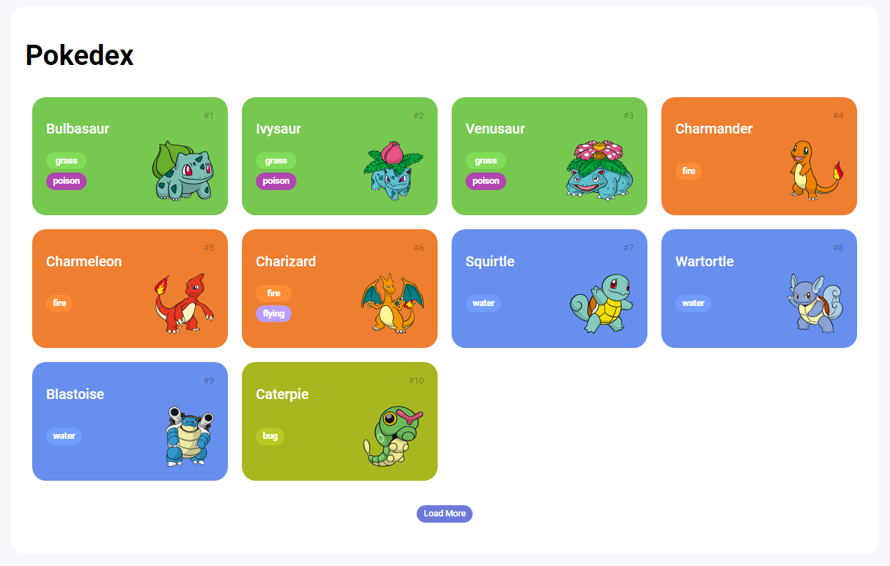
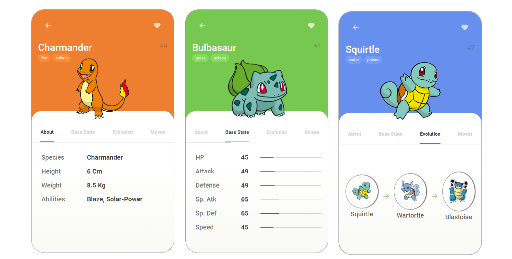

# Trilha JS Developer - Pokedex



- Projeto de Pokedex, que exibe informações sobre vários Pokémons.

## Funcionalidades

- Exibe informações detalhadas sobre cada Pokémon selecionado.



## Tecnologias

Este projeto foi construído com as seguintes tecnologias:

- [HTML](https://developer.mozilla.org/pt-BR/docs/Learn/Getting_started_with_the_web/HTML_basics)
- [CSS](https://www.w3schools.com/css/default.asp)
- [JavaScript](https://developer.mozilla.org/en-US/docs/Web/javascript)
- [PokéAPI](https://pokeapi.co/)

## Como Usar

- Clone o projeto:

```bash
  git clone https://github.com/virginiamaia/js-developer-pokedex.git

```

- Abra o arquivo index.html em seu navegador.
